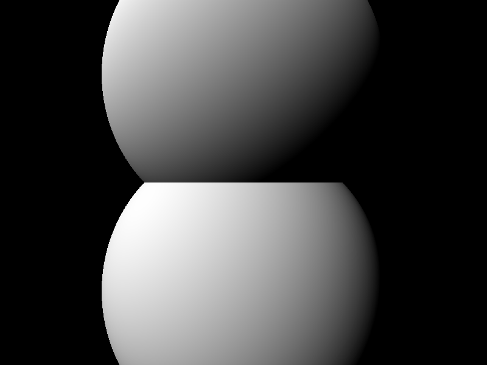

# Generelle

Experimental library for programmatic specification of geometry and textures


## Algebraic Geometry Construction

The below image shows an example of two spheres of radii 1.5, with centers at `y = -1` and `y = 1`. They are defined using signed distance functions (SDFs), look to [Inigo Quilez](https://www.youtube.com/channel/UCdmAhiG8HQDlz8uyekw4ENw) for inspiration/explanation.



The code for creating this geometry is:

```
    gn::GE ge1 = gn::makeSphere(falg::Vec3(0.0f, -1.0f, 0.0f), 1.5f);
    gn::GE ge2 = gn::makeSphere(falg::Vec3(0.0f, 1.0f, 0.0f), 1.5f);

    gn::GE sum = ge1.add(ge2);
```

Okay, so this is cool and all, but we could have done this with any mesh-based models too, right?

Hold on to your hats and have a look at the _smooth add_:


The code for creating this geometry is:

```
    gn::GE ge1 = gn::makeSphere(falg::Vec3(0.0f, -1.0f, 0.0f), 1.5f);
    gn::GE ge2 = gn::makeSphere(falg::Vec3(0.0f, 1.0f, 0.0f), 1.5f);

    gn::GE sum = ge1.smoothAdd(ge2, 0.5f);
```

Because of the flexibility of SDFs, we can add two spheres "smoothly", allowing a clean transition between the two surfaces (and their normals). Here's hoping this can be really useful and really cool in the future.

## Q&A

Q: _I like cubes. Y no cube_

A: Patience, you cubicle.

<br/>

Q: _I like meshes, plz give me mshes_

A: Patience, young diciple.

<br/>

Q: _Where are the textures?_

A: Patience, you two-dimensional pleb.